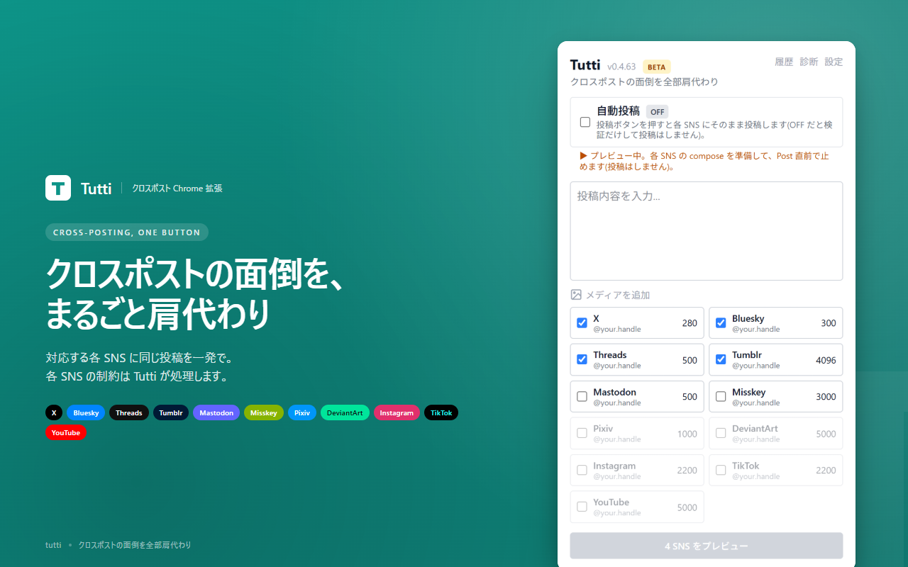

# Tutti (日本語)

> クロスポストの面倒を全部肩代わりする Chrome 拡張機能

[English](./README.md) &middot; [简体中文](./README.zh-Hans.md) &middot; [繁體中文](./README.zh-Hant.md) &middot; [한국어](./README.ko.md) &middot; [Español](./README.es-ES.md) &middot; [Español (LatAm)](./README.es-419.md) &middot; [Português (BR)](./README.pt-BR.md) &middot; [Português (PT)](./README.pt-PT.md) &middot; [Русский](./README.ru.md) &middot; [Deutsch](./README.de.md) &middot; [Français](./README.fr.md) &middot; [Polski](./README.pl.md) &middot; [Türkçe](./README.tr.md) &middot; [Italiano](./README.it.md) &middot; [Čeština](./README.cs.md) &middot; [Українська](./README.uk.md) &middot; [Magyar](./README.hu.md) &middot; [ไทย](./README.th.md) &middot; [Tiếng Việt](./README.vi.md) &middot; [Nederlands](./README.nl.md) &middot; [Svenska](./README.sv.md) &middot; [العربية](./README.ar.md) &middot; [Bahasa Indonesia](./README.id.md) &middot; [Suomi](./README.fi.md) &middot; [Ελληνικά](./README.el.md) &middot; [Български](./README.bg.md) &middot; [Norsk](./README.no.md) &middot; [Română](./README.ro.md) &middot; [Dansk](./README.da.md) &middot; [Esperanto](./README.eo.md)

複数の SNS に同じ投稿を一気に流す Chrome 拡張機能です (11 ネットワーク対応)。
文字数オーバーは自動分割 (X はリプライチェーンでスレッド化)、画像は各 SNS の
制約に自動リサイズ、動画は尺・サイズを判定し、上限超えは `ffmpeg.wasm` で
自動圧縮してから送信します。
**投稿内容は第三者サーバーを一切経由しません。**

🔒 [プライバシーポリシー](https://tutti.komm64.com/privacy.html)



## できること

- 📤 **マルチ SNS 同時投稿** — 一度書けば、選んだ全ての SNS にワンクリック (11 ネットワーク)
- ✂️ **文字数オーバーの自動分割** — `(1/N)` 形式で連番付きの逐次投稿。X は **リプライチェーン** で繋いでスレッド化、それ以外は独立投稿
- `#hashtag` を境界で途中切断しない / Bluesky では **rich text facets** (タグ・URL annotations) を自動付与
- 🖼️ **画像最大 4 枚 + 自動リサイズ** — Bluesky の 1MB 等の厳しい制限にも自動でフィット
- 🎬 **動画送信 + 自動圧縮** — 各 SNS の上限超えは `ffmpeg.wasm` (offscreen document) でその場で再エンコード
- 🔌 **公式 API 経由オプション** — Bluesky / Mastodon / Misskey は credentials を登録すると DOM 操作を経由せず API 直叩きで投稿 (SNS UI 変更に強い)
- 📊 **ライブ進捗表示** — 各 SNS の投稿状況をリアルタイムで確認
- 🪪 **ログイン中アカウント表示** — popup で「いまどのアカウントから投稿されるか」が見える (誤爆防止)
- 🛡️ **autoPost トグル** — 初期値 OFF。各 SNS の compose ページに本文・添付を入れて投稿ボタン手前で止める "preview" モードが既定 (誤投稿事故防止)
- 📜 **投稿履歴** — 直近 20 件をローカルに保存
- 💾 **下書き自動保存** — popup を閉じてもテキストは消えない
- ⌨️ **Ctrl/Cmd + Enter で投稿**
- ⚙️ **Mastodon / Misskey インスタンス切り替え** — 設定画面から任意のインスタンスを指定可能
- 🩹 **Selector hot-fix** — SNS の DOM が変わって投稿経路が壊れても、拡張更新を待たずに `selectors.json` を fetch して当日中に修復可能
- 🐞 **障害報告ボタン** — popup から redacted DOM snapshot 付きで GitHub Issue を 1 クリック作成 (auto-triage → selector PR まで自動化)
- 🌐 **多言語対応** — 日本語 / English (popup / options 両方)

## 対応 SNS

11 ネットワーク対応。実機投稿で安定確認できているものを「Stable」、
adapter 実装は済んでいるが実投稿の動作確認が浅いものを「Experimental」と
区別しています。Experimental は preview (autoPost OFF) での検証から始めるのを推奨。

### Stable (実投稿確認済)

| ネットワーク | text | image | shortVideo | longVideo | 経路 |
|---|:---:|:---:|:---:|:---:|---|
| X (旧 Twitter) | ✅ | ✅ | ✅ | ✅ | DOM |
| Bluesky | ✅ | ✅ | ✅ | — | DOM + API |
| Threads | ✅ | ✅ | ✅ | ✅ | DOM |
| Mastodon | ✅ | ✅ | ✅ | ✅ | DOM + API |
| Misskey | ✅ | ✅ | ✅ | ✅ | DOM + API |
| Tumblr | ✅ | ✅ | ✅ | ✅ | DOM |
| Pixiv | — | ✅ | — | — | DOM (multi-step) |
| TikTok | — | — | ✅ | — | DOM (multi-step) |
| YouTube (Shorts) | — | — | ✅ | — | DOM (multi-step) |

### Experimental (adapter のみ・autoPost 実投稿は未検証)

| ネットワーク | text | image | shortVideo | longVideo | 経路 |
|---|:---:|:---:|:---:|:---:|---|
| Instagram | — | ✅ | ✅ | — | DOM (multi-step) |
| DeviantArt | — | ✅ | — | — | DOM (multi-step) |

「経路」の意味:
- **DOM**: SNS の Web 投稿ページを自動操作する経路 (anti-bot 対策の影響を受けやすい)
- **DOM + API**: Settings で credentials を登録すると公式 API 経路に切り替わる。
  API 失敗時は DOM に **フォールバックしない** (= 明示的に user へ通知)。
  credentials を登録しない通常運用では DOM 経路のみ
- **multi-step**: 複数モーダルの wizard 型 UI 用 (P12 framework `executeMultiStepFlow`)

各 SNS の文字数 / サイズ制約 / 検証状態 / 既知の不安定点は
[docs/platform-matrix.md](./docs/platform-matrix.md) に一覧。

## インストール

### Chrome Web Store

公開済み (Unlisted): [Chrome Web Store の Tutti](https://chromewebstore.google.com/detail/tutti/mcjfgdcffjfhkcepfpnifcpknlddmbpe)

### 開発版

[Releases](https://github.com/komm64/tutti/releases) から最新の zip をダウンロードして:

1. 解凍
2. `chrome://extensions/`(Brave なら `brave://extensions/`)を開く
3. 「デベロッパーモード」を ON
4. 「パッケージ化されていない拡張機能を読み込む」→ 解凍したフォルダを選択

## プライバシー

投稿テキスト・画像・動画は**ユーザーのブラウザ内でのみ**処理され、
第三者のサーバーには送信されません。
詳細は[プライバシーポリシー](https://tutti.komm64.com/privacy.html)。

## 責任ある利用と免責事項

Tutti は利用者が開始した投稿操作を補助するツールです。投稿内容、
使用アカウント、各プラットフォームの利用規約・ルール・投稿制限・
コミュニティガイドライン・適用法令の遵守は利用者自身の責任です。
自動化、重複または類似内容、権利のないコンテンツ、センシティブ表示不足などは
プラットフォームによる制限対象になり得ます。

Tutti は現状有姿で提供され、法令上認められる最大限の範囲で責任を制限します。
全文: https://tutti.komm64.com/terms.html

## ライセンス

[All Rights Reserved](./LICENSE) — © 2026 komm64

ソースコードは透明性のため公開していますが、再配布・再利用・改変は許可していません。

---

## 開発(コントリビューター・コードレビュー向け)

このセクションは、コードを読んで動作を確認したい方や、
issue / PR を出してくださる方向けの情報です。

### 技術スタック

- [WXT](https://wxt.dev/) — Vite ベースの MV3 拡張ビルドツール
- TypeScript (strict + `noUncheckedIndexedAccess`)
- Svelte 5 (runes)
- Tailwind CSS v4
- Vitest (単体テスト) / Playwright + puppeteer-core (実投稿 E2E)
- `@ffmpeg/ffmpeg` (動画再エンコード、offscreen document 配下)

### コマンド

```bash
npm install
npm run dev           # Chrome 用 HMR 開発サーバー
npm run dev:firefox   # Firefox 用
npm run build         # 本番ビルド (.output/chrome-mv3/)
npm run zip           # Chrome Web Store 提出用 zip
npm run compile       # 型チェック
npm test              # 単体テスト (vitest)
npm run test:e2e-api  # API 経路の実投稿 E2E (credentials 必要)
npm run e2e           # DOM 経路の実投稿 E2E (self-hosted runner 前提)
```

### ディレクトリ構成

```
entrypoints/
  background.ts                  - service worker (orchestrator)
  popup/                         - popup UI (Svelte 5)
  options/                       - 設定画面 (Svelte 5)
  offscreen/                     - 動画再エンコード用 offscreen document (ffmpeg.wasm)
  inject-helper.content.ts       - MAIN-world helper (file input 注入 / drop dispatch)
  tumblr-probe.content.ts        - Tumblr の page world 状態取得 (MAIN-world)
  {x,bluesky,threads,mastodon,misskey,tumblr,pixiv,tiktok,youtube,
   instagram,deviantart}.content.ts
                                 - 各 SNS 用 content script
src/
  messages.ts                    - popup/background/content 間のメッセージ型
  storage.ts                     - chrome.storage 集約 API
  adapters/                      - 各 SNS の metadata・URL・selectors (registry.ts で束ねる)
  api/                           - 公式 API クライアント (bluesky / mastodon / misskey)
                                   + Bluesky rich text facets / limits probe
  utils/                         - 共通ユーティリティ
                                   (split, step-runner, image-resize, post-flow,
                                    selector-overrides, binary-transfer, …)
public/
  icon/                          - 拡張アイコン
  _locales/{ja,en}/messages.json - 翻訳
  ffmpeg/                        - ffmpeg.wasm core / wasm (postinstall でコピー)
docs/
  index.html                     - 公開サイトのトップページ
  privacy.html                   - プライバシーポリシーページ
  support.html                   - サポート / FAQ ページ
  platform-matrix.md             - 11 ネットワークの SoT (制約・検証状態)
  selectors.json                 - selector hot-fix の配信元
  store-listing.md               - Web Store 申請ドラフト
scripts/
  e2e/                           - 実投稿 E2E (Playwright / puppeteer-core CDP attach)
  cws/                           - Chrome Web Store Publish API CLI
worker/                          - 障害報告 → GitHub Issue 化する CF Workers relay
```
