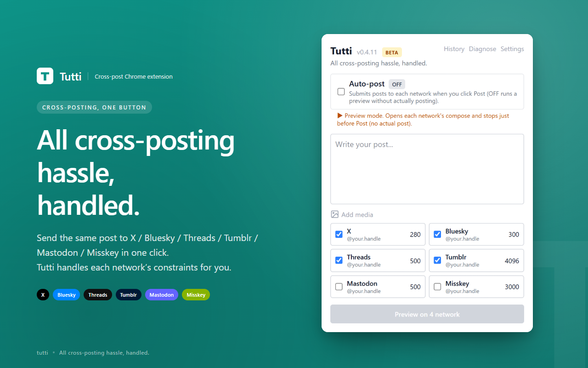

# Tutti

> All cross-posting hassle, handled — one Chrome extension, eleven networks.

[日本語](./README.ja.md) &middot; [简体中文](./README.zh-Hans.md) &middot; [繁體中文](./README.zh-Hant.md) &middot; [한국어](./README.ko.md) &middot; [Español](./README.es-ES.md) &middot; [Español (LatAm)](./README.es-419.md) &middot; [Português (BR)](./README.pt-BR.md) &middot; [Português (PT)](./README.pt-PT.md) &middot; [Русский](./README.ru.md) &middot; [Deutsch](./README.de.md) &middot; [Français](./README.fr.md) &middot; [Polski](./README.pl.md) &middot; [Türkçe](./README.tr.md) &middot; [Italiano](./README.it.md) &middot; [Čeština](./README.cs.md) &middot; [Українська](./README.uk.md) &middot; [Magyar](./README.hu.md) &middot; [ไทย](./README.th.md) &middot; [Tiếng Việt](./README.vi.md) &middot; [Nederlands](./README.nl.md) &middot; [Svenska](./README.sv.md) &middot; [العربية](./README.ar.md) &middot; [Bahasa Indonesia](./README.id.md) &middot; [Suomi](./README.fi.md) &middot; [Ελληνικά](./README.el.md) &middot; [Български](./README.bg.md) &middot; [Norsk](./README.no.md) &middot; [Română](./README.ro.md) &middot; [Dansk](./README.da.md) &middot; [Esperanto](./README.eo.md)

Tutti lets you write once and broadcast the same post to all your social
networks with a single click (11 networks supported). Over-the-limit text
is auto-split (X uses a proper reply-chain so it becomes a thread); images
are auto-resized to each platform's constraints; videos are inspected for
duration / size, and oversized clips are transcoded on the fly with
`ffmpeg.wasm`.

**Your post content never touches any third-party server.**

🔒 [Privacy Policy](https://komm64.github.io/tutti/)



## Features

- 📤 **Multi-network broadcast** — write once, click once, post to every network you've selected (11 networks)
- ✂️ **Auto-split for over-limit text** — numbered as `(1/N)`, posted sequentially. On X they're connected as a **reply chain (thread)**, on other networks they post independently
- `#hashtag` boundaries are preserved across splits / Bluesky gets proper **rich-text facets** (clickable tags + URL annotations)
- 🖼️ **Up to 4 images + auto-resize** — fits into tight limits like Bluesky's 1 MB cap automatically
- 🎬 **Video posting + auto-compression** — over-limit clips are re-encoded in place by `ffmpeg.wasm` (in an offscreen document)
- 🔌 **Optional official-API path** — for Bluesky / Mastodon / Misskey, register credentials in Settings and Tutti posts via the public API instead of DOM scripting (resilient to SNS UI changes)
- 📊 **Live progress** — see each network's status in real time
- 🪪 **Logged-in account display** — the popup shows which account each network will post from (helps prevent accidents)
- 🛡️ **autoPost toggle** — off by default. The default mode opens each compose page, fills the body + attachments, and **stops short of clicking the post button** ("preview" mode) so you can spot mistakes
- 📜 **Post history** — last 20 entries saved locally
- 💾 **Auto-saved drafts** — your text survives closing the popup
- ⌨️ **Ctrl/Cmd + Enter to post**
- ⚙️ **Mastodon / Misskey instance switching** — point at any instance from Settings
- 🩹 **Selector hot-fix** — when a SNS DOM changes and breaks a path, Tutti can fetch a `selectors.json` patch so you don't have to wait for the next extension release
- 🐞 **Bug-report button** — one click from the popup files a GitHub issue with a redacted DOM snapshot (auto-triage pipeline turns that into a selector PR)
- 🌐 **Localized** — English / Japanese (popup + options)

## Supported networks

11 networks. "Stable" means real posting has been verified end-to-end;
"Experimental" means the adapter is wired up but autoPost real-post
hasn't been fully validated yet. For Experimental ones, start in preview
mode (autoPost OFF).

### Stable (real posting verified)

| Network | text | image | shortVideo | longVideo | Path |
|---|:---:|:---:|:---:|:---:|---|
| X (formerly Twitter) | ✅ | ✅ | ✅ | ✅ | DOM |
| Bluesky | ✅ | ✅ | ✅ | — | DOM + API |
| Threads | ✅ | ✅ | ✅ | ✅ | DOM |
| Mastodon | ✅ | ✅ | ✅ | ✅ | DOM + API |
| Misskey | ✅ | ✅ | ✅ | ✅ | DOM + API |
| Tumblr | ✅ | ✅ | ✅ | ✅ | DOM |
| Pixiv | — | ✅ | — | — | DOM (multi-step) |
| TikTok | — | — | ✅ | — | DOM (multi-step) |
| YouTube (Shorts) | — | — | ✅ | — | DOM (multi-step) |
| Instagram | — | ✅ | ✅ | — | DOM (multi-step) |

### Experimental (adapter only; autoPost real-post not yet verified)

| Network | text | image | shortVideo | longVideo | Path |
|---|:---:|:---:|:---:|:---:|---|
| DeviantArt | — | ✅ | — | — | DOM (multi-step) |

What "Path" means:
- **DOM**: Tutti automates the SNS's web compose UI (more sensitive to anti-bot changes)
- **DOM + API**: If you save credentials in Settings, Tutti switches to the official API.
  On API failure Tutti **does not silently fall back to DOM** — you'll see an explicit error.
  Without credentials, only the DOM path runs.
- **multi-step**: For wizard-style modals across multiple steps (framework: `executeMultiStepFlow`)

Per-network character / size limits, verification status, and known
flaky spots are tracked in
[docs/platform-matrix.md](./docs/platform-matrix.md).

## Install

### Chrome Web Store

Published (Unlisted): [Tutti on the Web Store](https://chromewebstore.google.com/detail/tutti/mcjfgdcffjfhkcepfpnifcpknlddmbpe)

### Unpacked / dev build

Download the latest zip from [Releases](https://github.com/komm64/tutti/releases), then:

1. Unzip it
2. Open `chrome://extensions/` (or `brave://extensions/` on Brave)
3. Turn on "Developer mode"
4. Click "Load unpacked" and pick the unzipped folder

## Support

Questions, bug reports, feature requests:
**[komm64.github.io/tutti/support.html](https://komm64.github.io/tutti/support.html)**

Or email **contact@komm64.com**.

## Privacy

Post text, images, and video are processed **entirely inside your
browser** — they are never sent to any third-party server.
See the [privacy policy](https://komm64.github.io/tutti/) for details.

## License

[All Rights Reserved](./LICENSE) — © 2026 komm64

The source code is published for transparency. Redistribution, reuse, or
modification is not permitted.

---

## Development (for contributors / code reviewers)

This section is for people who want to read the code, reproduce builds,
or send issues/PRs.

### Stack

- [WXT](https://wxt.dev/) — Vite-based MV3 extension build tool
- TypeScript (strict + `noUncheckedIndexedAccess`)
- Svelte 5 (runes)
- Tailwind CSS v4
- Vitest (unit) / Playwright + puppeteer-core (real-post E2E)
- `@ffmpeg/ffmpeg` (video re-encode, inside an offscreen document)

### Commands

```bash
npm install
npm run dev           # Chrome HMR dev server
npm run dev:firefox   # Firefox dev server
npm run build         # production build (.output/chrome-mv3/)
npm run zip           # build a zip for Chrome Web Store submission
npm run compile       # type-check
npm test              # unit tests (vitest)
npm run test:e2e-api  # API-path real-post E2E (credentials required)
npm run e2e           # DOM-path real-post E2E (self-hosted runner expected)
```

### Layout

```
entrypoints/
  background.ts                  - service worker (orchestrator)
  popup/                         - popup UI (Svelte 5)
  options/                       - settings UI (Svelte 5)
  offscreen/                     - offscreen document for video re-encoding (ffmpeg.wasm)
  inject-helper.content.ts       - MAIN-world helper (file-input injection / drop dispatch)
  tumblr-probe.content.ts        - Tumblr page-world state probe (MAIN-world)
  {x,bluesky,threads,mastodon,misskey,tumblr,pixiv,tiktok,youtube,
   instagram,deviantart}.content.ts
                                 - per-SNS content scripts
src/
  messages.ts                    - typed messages between popup / background / content
  storage.ts                     - chrome.storage wrapper
  adapters/                      - per-SNS metadata / URL / selectors (registered via registry.ts)
  api/                           - official-API clients (bluesky / mastodon / misskey),
                                   plus Bluesky rich-text facets and limits probe
  utils/                         - shared utilities
                                   (split, step-runner, image-resize, post-flow,
                                    selector-overrides, binary-transfer, …)
public/
  icon/                          - extension icons
  ffmpeg/                        - ffmpeg.wasm core / wasm (copied by postinstall)
locales/{ja,en}/messages.json    - canonical BCP 47 translation sources
docs/
  index.html                     - GitHub Pages privacy policy page
  support.html                   - support / FAQ page (English)
  support.ja.html                - support / FAQ page (Japanese)
  platform-matrix.md             - source of truth for the 11 networks (limits + verification)
  selectors.json                 - selector hot-fix feed (served via GH Pages)
  store-listing.md               - Web Store submission draft
scripts/
  e2e/                           - real-post E2E (Playwright / puppeteer-core CDP attach)
  cws/                           - Chrome Web Store Publish API CLI
worker/                          - CF Workers relay turning bug reports into GitHub issues
```
